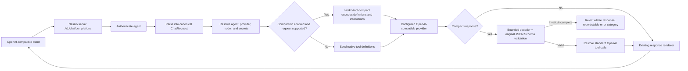

# Compact tools: architecture and local setup

This guide explains where compact tool schemas run in Nasiko, how to enable them for local development, and how to exercise the implementation.

## Run the compact-tools demonstration

From the repository root:

```sh
cargo run --release -p nasiko-llm-router --example compact_tools_demo
```

Open `http://127.0.0.1:8765`. This local example calls the same
`prepare_request` and `Prepared::restore` functions as the router. Edit a standard
request, inspect its compact payload and full-request token counts, and validate
sample model output. The buttons demonstrate a valid call, an enum violation,
atomic rejection of a valid call followed by an unknown tool, and a native bypass
for an unsupported schema. Schema reconstruction is checked from the compact
text itself.

This is an offline runtime demonstration: no provider calls, tool execution,
database, or full Nasiko platform startup are required. It does not demonstrate
authentication or hosted-model quality. `DEMO_BIND` optionally changes the bind
address; the default is loopback. Hosted inference evidence is generated separately
by `compact_tools_eval` with `LIVE_BASELINE=1`.

[Watch the recorded run](assets/compact-tools-demo.mp4) and inspect the
[live/offline evidence](compact-tools-evidence/README.md).

## Request path

The application continues to send an ordinary OpenAI Chat Completions request with JSON Schema tool definitions. Compaction happens inside Nasiko after authentication and model/provider resolution; callers do not need to learn or produce the compact syntax.



`tool-compact` owns deterministic schema encoding, strict JSON handling, and bounded streaming decoding. `llm-router` owns eligibility policy, provider integration, and restoration into Nasiko's ordinary tool-call representation. The existing tool executor and client response format remain unchanged. The router records the provider's reported usage; it does not estimate billed savings from byte counts.

## Enablement and safety gates

The feature is disabled by default. To use it for an agent, all of these conditions must hold:

1. The server/router environment has `COMPACT_TOOLS_ENABLED=true`.
2. That agent's existing `compress_enabled` setting is enabled.
3. `TOKEN_COMPRESS_ENABLED` is not false and `TOKEN_COMPRESS_DRY_RUN` is not true.
4. The request is supported: OpenAI Chat Completions to the OpenAI provider, non-streaming, no fallback chain, and no unsupported tool choice/history/options/schema.
5. The candidate serialized request is smaller than the native request.

Otherwise the router retains the native request. The initial integration deliberately bypasses streaming and unsupported provider/API combinations; see [compact-tools.md](compact-tools.md#enabling-the-integration) for the complete list.

## Start the local Nasiko stack

From the repository root, make a local ignored environment file from the development template. Do not use the template defaults for a public deployment.

PowerShell:

```powershell
Copy-Item .env.example .env
Add-Content .env "`nCOMPACT_TOOLS_ENABLED=true`nTOKEN_COMPRESS_ENABLED=true`nTOKEN_COMPRESS_DRY_RUN=false"
docker compose up -d --build
docker compose ps
Invoke-WebRequest http://localhost:8080/health
```

macOS/Linux:

```sh
cp .env.example .env
printf '\nCOMPACT_TOOLS_ENABLED=true\nTOKEN_COMPRESS_ENABLED=true\nTOKEN_COMPRESS_DRY_RUN=false\n' >> .env
docker compose up -d --build
docker compose ps
curl -fsS http://localhost:8080/health
```

The UI is served at `http://localhost:8080`. The default provider key in the example environment is a placeholder, so health/UI startup does not prove that live model inference works. For live inference, configure a real provider credential in the local Nasiko UI or environment, select it for an agent, and enable that agent's compression setting. Keep credentials out of source control and command output.

To stop the development stack, run `docker compose down`. Add `-v` only when you intentionally want to delete the local Postgres and object-store data volumes.

## Use it from an application

No compact-specific code is needed in an application. Point its existing OpenAI client to Nasiko's `/v1` endpoint using the agent's normal Nasiko credential and configured model. Continue passing standard messages and JSON Schema tools. When the request is eligible, Nasiko compacts the definitions before the provider call and restores valid model calls before returning the response.

Conceptually, the application request remains:

```json
{
  "model": "<agent-configured-model>",
  "messages": [{"role": "user", "content": "Create a calendar event"}],
  "tools": [{
    "type": "function",
    "function": {
      "name": "create_event",
      "description": "Create a calendar event",
      "parameters": {
        "type": "object",
        "properties": {"title": {"type": "string"}},
        "required": ["title"],
        "additionalProperties": false
      }
    }
  }]
}
```

The tool definition above is illustrative; it is not an end-to-end authenticated request. Use the agent credentials and trace/context headers generated by the normal Nasiko setup for your environment.

## Verify code and evaluation fixtures

From the repository root, run the offline checks without provider credentials:

```sh
cargo test -p nasiko-tool-compact -p nasiko-llm-router --lib --tests --examples --offline -j2
cargo run --release -p nasiko-llm-router --example compact_tools_eval
cargo run --release -p nasiko-llm-router --example compact_tools_report
```

These verify deterministic encoding/decoding, compatibility bypasses, and local token counts. They do not measure hosted-model adherence. For live model evaluation and its required environment variables, use the procedure in [compact-tools.md](compact-tools.md#evaluation).
