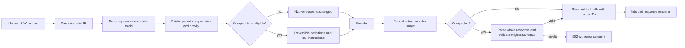

# Compact tool schemas in Nasiko

For the request-path diagram, local full-stack setup, and application usage, see [Compact tools: architecture and local setup](compact-tools-architecture.md).

For raw live outputs, measured token/accuracy comparisons, and the running demo
recording, see [measured evidence](compact-tools-evidence/README.md). The current
protocol's results supersede the earlier 30% offline-only measurement.

## Architecture and scope

Nasiko's server is the shared ingress for agent runtime and control-plane traffic.
Authentication, per-agent configuration and secrets determine which provider an
agent may use. Agent selection in `orchestrator/` and tool permissions in
`mcp-gateway/` are distinct from the model selection in `llm-router/`.

The LLM router parses inbound OpenAI, Anthropic, or Gemini requests into its chat
IR (`src/ir/chat.rs`). Its resolver selects provider credentials and configuration;
the routing module selects model strength at safe conversation boundaries. Provider
clients translate the IR for the destination, and inbound renderers translate the
response for the caller. The native Responses API has a separate handler.

Existing `src/compress.rs` reduces tool-result payloads. `src/brevity.rs` supplies
an output-length directive. Compact tools targets a different source of overhead:
the repeated **definitions of available functions**. It uses the same fail-closed,
deterministic policy: never alter routing inputs, and retain the native request if
the transformation cannot preserve its contract.



The independent `nasiko-tool-compact` library owns the grammar, reversible schema
encoding and validator-backed streaming decoder. It has no environment access,
provider clients, model calls, tokenizers or dependency on Nasiko's router.

## Enabling the integration

Set `COMPACT_TOOLS_ENABLED=true` in the router/server environment. The existing
agent `compress_enabled` opt-in must also be true. `TOKEN_COMPRESS_ENABLED=false`
or `TOKEN_COMPRESS_DRY_RUN=true` retains native requests. Configuration is read
only by `src/config.rs`; the pure library receives explicit inputs.

The initial integration supports the OpenAI Chat Completions inbound surface,
OpenAI outbound provider, non-streaming requests, and no configured fallback-model
chain. The library independently supports incremental byte/text decoding. Router
streaming is intentionally bypassed until its completion, error and usage semantics
can be tested as a whole.

Other bypasses include:

- No tools, unsupported schemas, unknown tool/function fields, and provider `strict`.
- Forced or disabled `tool_choice` (`auto` and absence are supported).
- Tool-call/result history, legacy function calls, or a non-default response mode.
- Options whose guarantees depend on native tool calling: `parallel_tool_calls`,
  `response_format`, `stop`, multi-choice `n`, logprobs and unrecognized extras.
- A candidate whose entire serialized request is not smaller in bytes.

The byte guard is a cheap eligibility policy, **not** a token-saving measurement.
The evaluator measures real tokens separately with the mandated `o200k_base`
tokenizer. The tokenizer is an exact-pinned router **dev-dependency** used by
examples only; it is absent from the library's and service's runtime dependency graph.

Definitions are inserted after existing leading system/developer messages and
before the conversation, making a stable definition prefix for an unchanged
catalog. Existing messages are never edited. There is no schema cache, persistent
storage, database migration, gateway protocol change, or tool preselection.

## Output and failure semantics

Valid compact calls become normal OpenAI-shaped calls with router-generated IDs and
JSON-string arguments. Surrounding text and original provider usage survive.
Responses containing unknown tools, invalid arguments, duplicate JSON keys,
malformed/truncated calls or unexpected native tool calls fail as a whole. A
truncated/refused finish reason is not silently interpreted as a successful batch.
There is no model-based repair or automatic replay that could incur hidden cost.

Provider usage is recorded even when compact decoding fails. Debug events expose
`applied` and a bypass reason; rejected responses expose a stable error category.
No prompts, schemas, arguments or keys are added to these events. Token savings
are not inferred from byte counts or written into billing as measured savings.

## Evaluation

Fetch dependencies while network is available:

```sh
cargo fetch
curl -fsSL https://registry.nasiko.dev/r/nasiko/compact-tools-eval -o /tmp/compact-tools-eval.json
EVAL_SET=/tmp/compact-tools-eval.json OUT=/tmp/out.jsonl \
  cargo run --release -p nasiko-llm-router --example compact_tools_eval
```

No arguments are required. Without `EVAL_SET`, the unmodified public sample checked
in under `tests/fixtures/compact-tools-eval-v1.json` is used; without `OUT`, output
is `compact-tools-out.jsonl` in the working directory. Offline mode needs no key or
network, and contains no timestamps, random IDs or reported scores. Run it twice
and compare the JSONL bytes. Decoder chunks use the organizer's grammar directly;
there is no case conversion or case-ID-specific handling.

`rendered_calls` uses supplied expected calls only for the expressly required
offline serialization/decoding test. A bypass uses an ordinary JSON round trip and
reports `compacted:false`; it earns zero compression savings. Expected calls never
enter `compact_request`, live inference or production code.

For a live OpenAI-compatible endpoint:

```sh
PROVIDER_BASE_URL=https://your-proxy.example/v1 MODEL=your-model \
  EVAL_SET=/tmp/compact-tools-eval.json OUT=/tmp/live.jsonl \
  cargo run --release -p nasiko-llm-router --example compact_tools_eval
```

Keys are optional for the organizer's authenticated proxy. For a personal endpoint,
supply `PROVIDER_API_KEY` or `OPENAI_API_KEY` through the environment. Never commit
these values. The client defaults to temperature 0 and at most 1024 completion
tokens per call. Set `LIVE_TEMPERATURE` from 0 through 2 only when the provider
requires another value; it is 0 by default for the organizer's live scoring.
`LIVE_REASONING_EFFORT` can be set to `none`, `low`, `medium`, `high` or `xhigh`
when a model requires an explicit reasoning setting. Both are omitted from the
default live request except temperature 0. The client uses a 60-second timeout
and no retries or redirects. Network failures return nonzero with a sanitized
category/status. Only opt-in live mode makes network requests.

The router preserves `reasoning_effort` and `max_completion_tokens` while
compacting; a reasoning setting must not silently turn an adherence test into
native tool calling. Check `compacted` and `bypass_reason` in each output record.

Live calls include the organizer-confirmed reference time: **2026-10-03, Asia/Kolkata**.
`raw_output` and `live_calls` are written alongside per-case usage and latency.
`LIVE_BASELINE=1` additionally invokes native tool calling on the same inputs and
writes its outputs, usage and latency. This doubles model calls; it is off by default.

The organizer confirmed that the reference date is October 3, 2026. This makes
`ct-002`'s "tomorrow" timestamp of October 4 consistent with the sample. Preserve
the published fixture and reference date; do not change expected answers to tune
the evaluator.

The live protocol explicitly tells models to retain the literal `call` marker,
emit multiple calls in requested order, and omit unspecified optional fields.
These instructions are included in every token measurement. The earlier terse
protocol could make a model narrate an action or ask for optional values instead
of producing a tool call. Correctness takes priority over minimizing the
instruction string; compare both token reduction and live adherence.

Local measurements, separate from the organizer's scorer:

```sh
MEASURE_TOKENS=1 EVAL_SET=/tmp/compact-tools-eval.json OUT=/tmp/out.jsonl \
  cargo run --release -p nasiko-llm-router --example compact_tools_eval
EVAL_SET=/tmp/compact-tools-eval.json OUT=/tmp/out.jsonl \
  cargo run --release -p nasiko-llm-router --example compact_tools_report
```

The report includes per-case full-request token counts, compact format validity,
semantic matches, and provider-reported usage when every live case supplies it.
Serialized-body tokenizer estimates and provider usage are different measurements;
neither implies a measured dollar saving. Bypassed requests are reported with
zero reduction. Live and native usage stay separate, and missing usage is `null`.

For a browser demonstration of the real codec and router seam, run
`cargo run --release -p nasiko-llm-router --example compact_tools_demo` and open
`http://127.0.0.1:8765`. See the [architecture/setup guide](compact-tools-architecture.md).

The first command optionally prints aggregate token counts to stderr; its JSONL
contract is unchanged. The separate report reconstructs a native baseline and
counts full serialized bodies with `tiktoken-rs = 0.7.0`, `o200k_base`. It reports
round trips, decoder outcomes and live/native matches under the public rubric.
Bypasses count as zero savings. The organizer's private scorer is authoritative.

`tests/fixtures/compact-tools-generalization.json` is a separate author-created
development set. It covers nested shipments, nullable notes, booleans, bounds,
similar tools, Unicode, embedded delimiters, multiple/no calls and an unsupported
composition bypass. It is not held-out evidence and must be reported separately.

## Adoption limits

Before broader enablement, measure adherence on multiple providers and a larger
independent workload; review tool descriptions as prompt-bearing input; measure
retry/error rate, actual billed tokens (including cache effects), and latency.
Temperature 0 is not a guarantee of reproducibility from a hosted model. This
change proves deterministic local transforms, not deterministic remote inference.

Next extensions should be driven by measured use: schema composition/local references,
streaming router translation, tool-result history, and additional providers. Forced
tool-choice guarantees require a separate design. None is silently approximated.
